# RAVVAR-XunAPI
# 概述
XunAPI是RAVVAR团队基于Lua编写的一套开发接口，帮助开发能力强的个人或公司实现深度的AR交互。
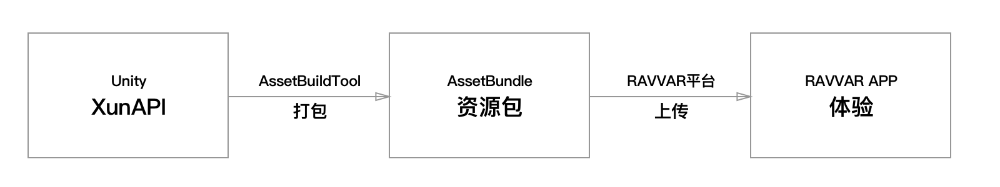 
XunAPI Unity Plugin结构：

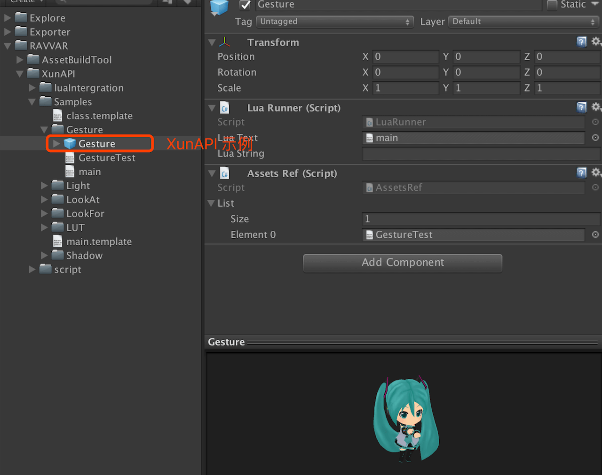 
**注意**

使用XunAPI开发场景时，若开发的场景太大或有BUG，皆有可能导致RAVVAR APP的崩溃或造成其他AR场景错乱，此时请从设备中将APP关闭，然后重新开启即可。

Unity版本：5.5.2

使用过程中如果遇到遇到任何问题可直接联系：wendell.yang@ravvar.cn

# 具体步骤
## 1.制作预制体
选择“RAVVAR - AssetBuildTool - Samples - Scenes - AR Experience”，打开参考场景；

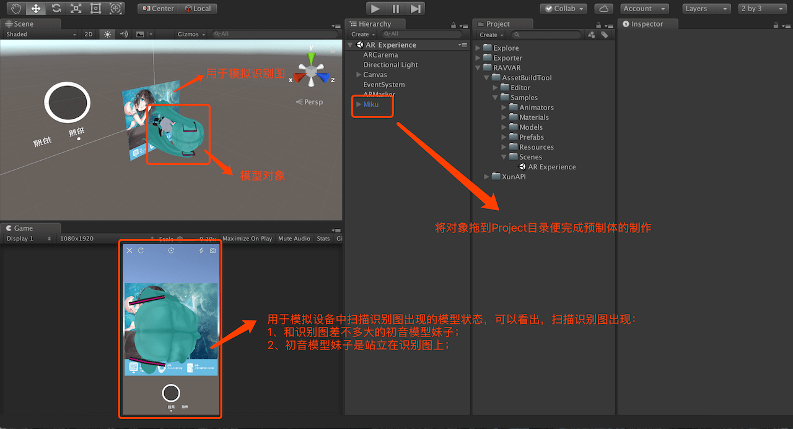 

## 2.基于XunAPI的Lua脚本挂载
2.1为之前的预制体制作空的父物体，用于相关脚本挂载；

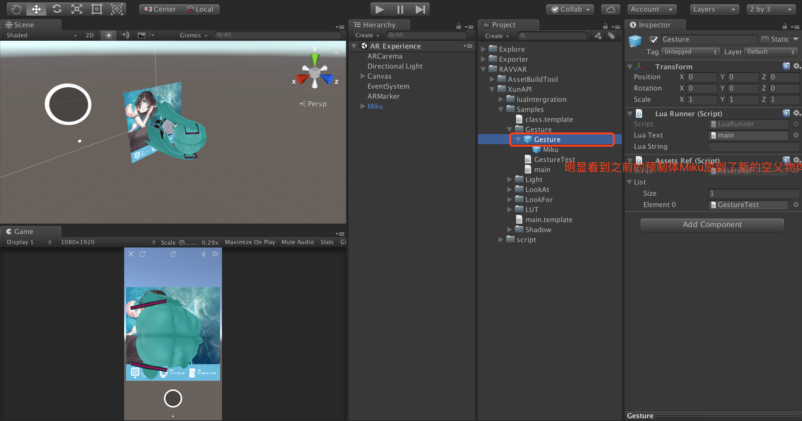 

2.2脚本挂载，请参考下图

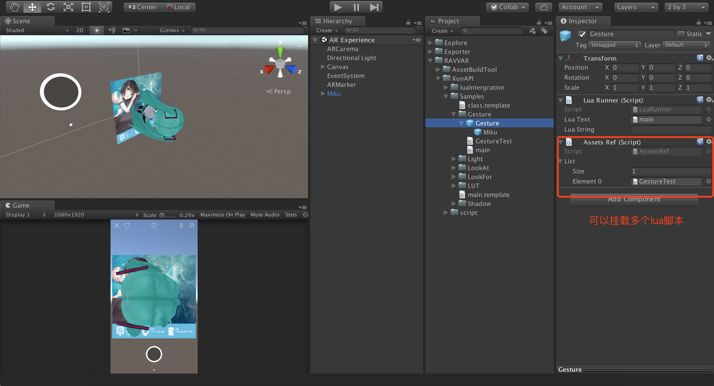 

**注意**
需要将自己编写的lua脚本手动改成txt文本文件，然后引入Unity工程中。
# 3.打包预制体
选择已经做好的一个或多个预制体文件，然后点击菜单栏“RAVVAR - Select Prefab”，最后点击“Build”并选择文件夹开始打包

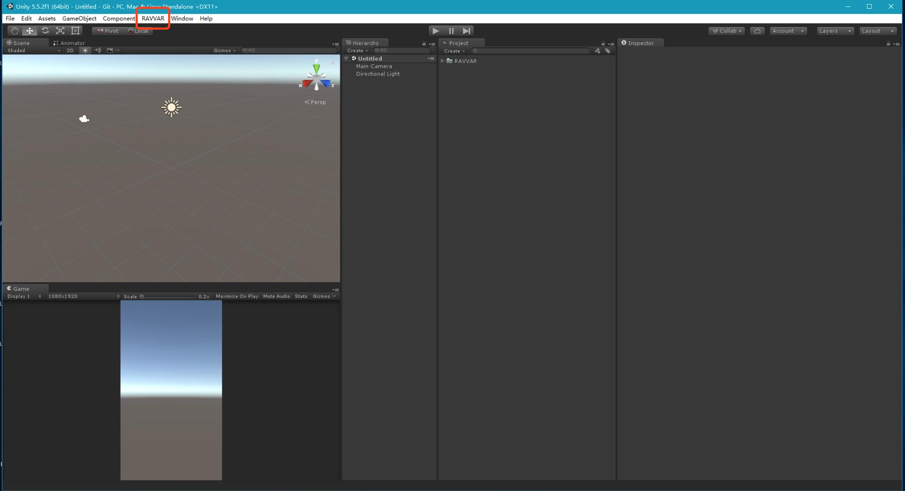

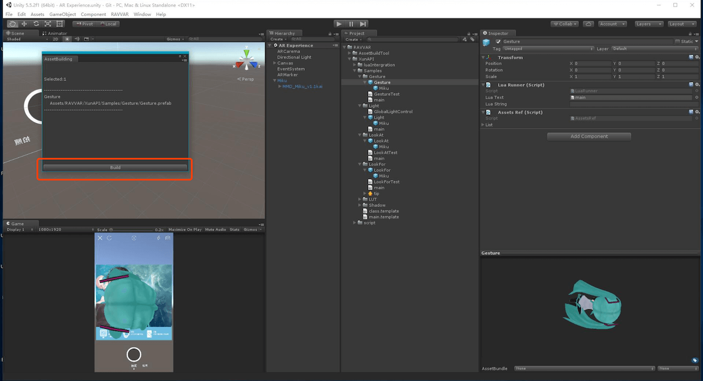 

# 4.上传到RAVVAR平台
第一步：新建AR项目；
第二步：选择“+AR模板”；
第三步：选择“Unity模型模板”，然后依次填写AR场景名称 - 上传识别图 - 上传打包完成的zip文件；
第四步：参数设置；

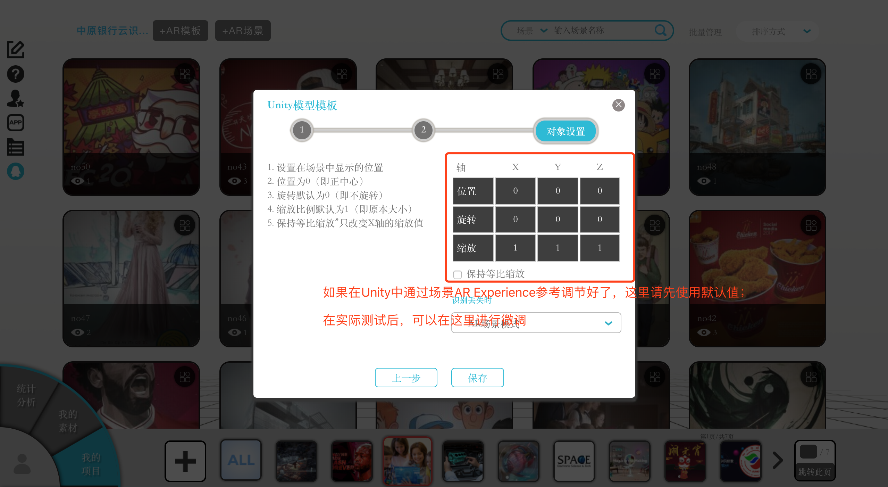 

第五步：打开RAVVAR APP扫描二维码体验
具体的步骤还可以观看此视频：

https://mp.weixin.qq.com/s/jfka1xcbKnugRGeNIV8kwA

# XunAPI示例说明

【Gesture】
手势示例，支持移动、缩放与旋转；

【Light】
禁用APP默认灯光，便于用户自定义灯光；

【LookAt】
将对象始终朝向这摄像机；

【Look For】
当某个对象不在摄像机画面下时，便出现一个箭头用于指示此对象在那个方位；

【LUT】
滤镜示例，可以修改工程中图片文件base_post_effect_lookup_table（基准查找表）来实现其它滤镜效果；可以采取如下方式来修改此文件：

第一步：选择“颜色查找”

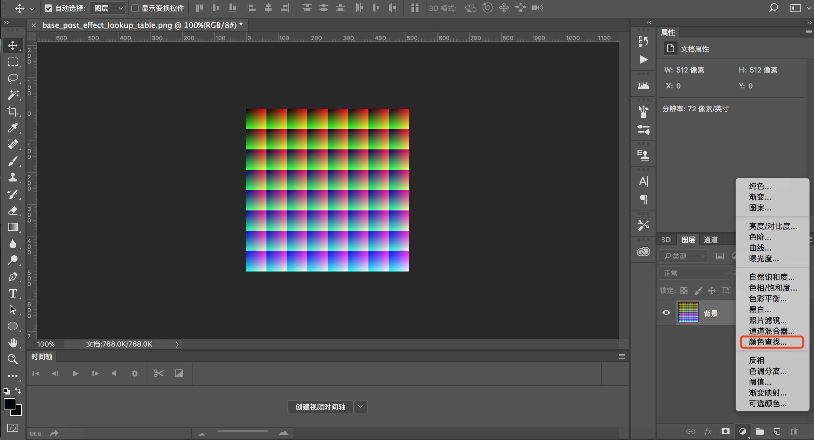 

第二步：选择“载入3D LUT”

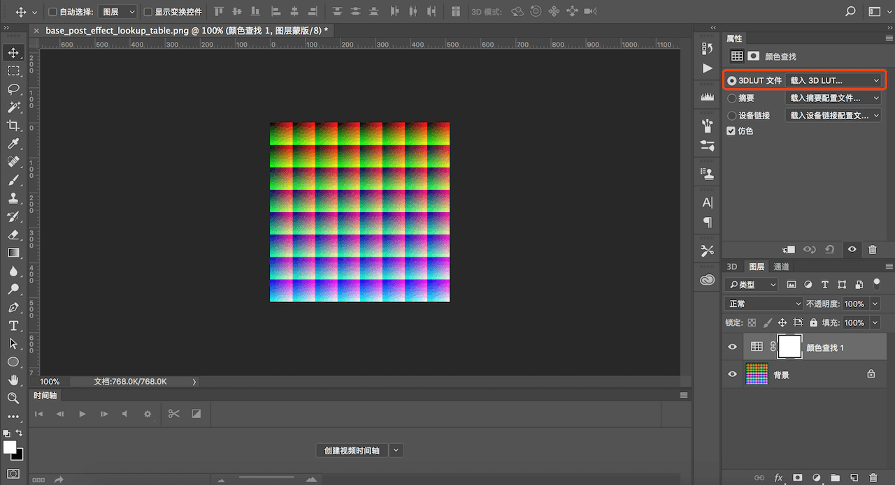 

第三步：选择具体的LUT文件来对原图调色；

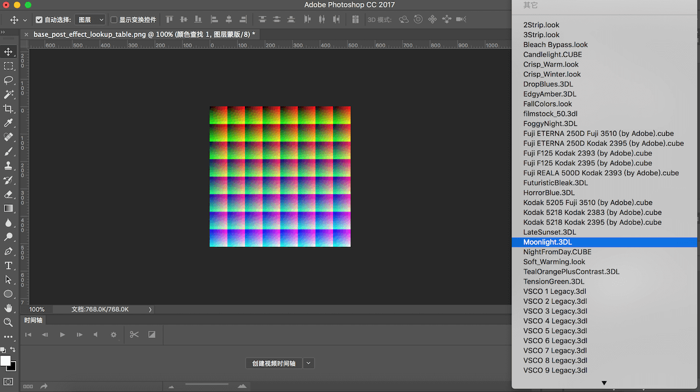 

【Shadow】
实时阴影示例，将阴影显示在现实环境中，增强AR的显示效果
# XunAPI接口说明
https://github.com/yangfawen/RAVVAR-XunAPI/blob/master/Doc/LuaAPI2.txt
